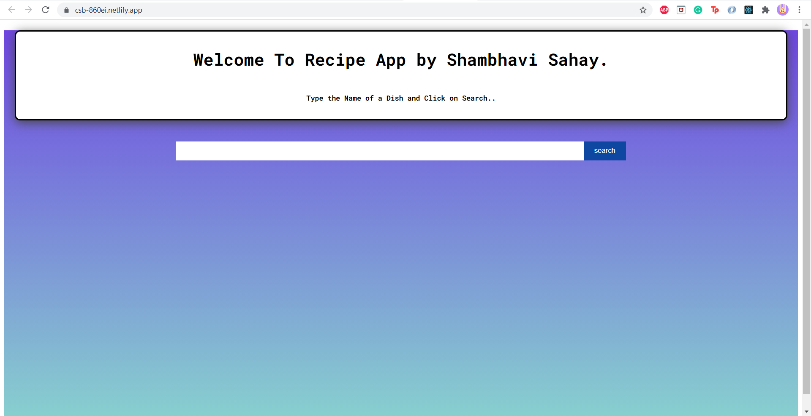
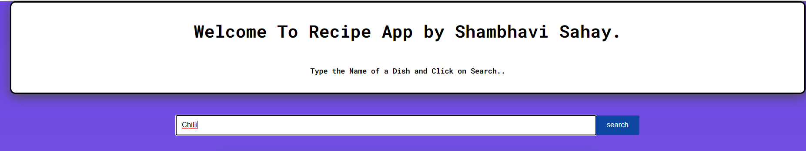
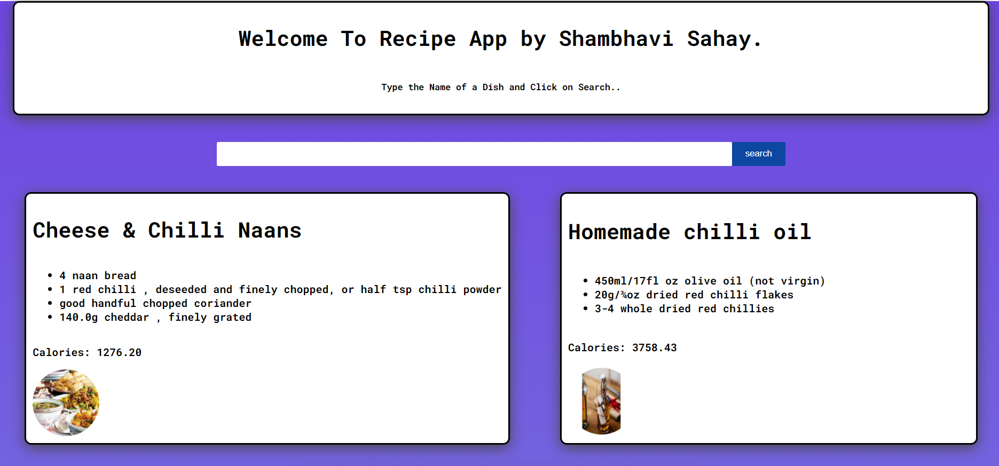

# Recipe App

The project can be accessed by clicking [HERE](https://csb-860ei.netlify.app/)

## Introduction
This is a react application that is used to search the recipes of food items based on the input given by the user. The web applications displays a single input field, where the user can enter the ingredients/food item name and upon clicking the search button, the user can view the recipe of food items related to the inputted ingredients/food item name.
## Methodology
Upon receiving the input from the user, the react app makes an API fetch request to the 3rd party Edamam recipe search endpoint. The API requires the following inputs:
```
q = Input
app_id = APP_ID 
app_key = APP_KEY
```
`app_id` and `app_key` were generated from the Edamam developer portal and are fixed for each query, whereas `q` is the input entered by the user of the main page of the application.\
Upon receiving the response object from the API via network requests, we used component based approach to handle the JSON response object. Further, CSS grid and media queries were used to make the application responsive.

## Input/Output Screenshots
<p>The homepage that is visible to the user on visiting the website is as follows:</p>

<p>
The user can search any ingredients/food item by typing it in the single input field. The view can be seen below:
</p>

<p>
Upon clicking the search button, we can see the dynamic nature of the website, as the page refreshes itself. This can be seen below:
</p>


